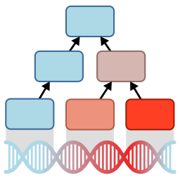

# Higana 

A cell-hierarchy based method for genetic association studies.

## Installation

You can install the development version of Higana using devtools:

```r
if (!requireNamespace("BiocManager", quietly = TRUE))
    install.packages("BiocManager")
BiocManager::install("GenomicRanges")

devtools::install_github("SimonLarsen/higana")
```

## Cite

If you use Higana in your research please cite the following publication:

> Publication details to be announced

## Contact

If you want to contact us regarding Higana please contact us in the following order:

* Simon Larsen: simonhffh (AT) gmail (DOT) com
* Jan Baumbach: jan (DOT) baumbach (AT) wzw (DOT) tum (DOT) de
